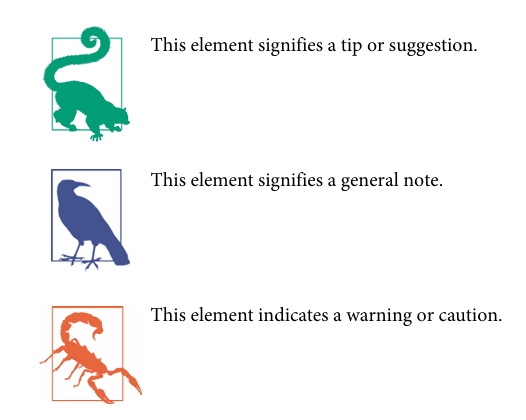

Summarize what I read from pages 1 to 7. I learned what machine learning is. Machine learning is when a computer learns how to solve problems on its own, without us having to manually create a program step by step.

We can combine many approaches in machine learning, such as supervised learning (where the model is trained by humans), online learning (where the model learns incrementally in real time), and instance-based vs. model-based learning (comparing data with other data or building general models). These approaches are not exclusive—meaning we don’t have to use only one method at a time.

The purposes of machine learning include gaining insights from complex problems, solving problems that are difficult or impossible to solve with traditional methods, simplifying code, and improving performance.

Essential Terminology
- Training Set and Instances: The examples a system uses to learn are called the training set. Each example is a training instance (or sample).
- Predictors and Labels: In regression, the input features (e.g., mileage, age) used to make predictions are called predictors, and the predicted value (e.g., price) is the label

different of Attribute between Feature: An attribute is a data type (e.g., "Mileage"), while a feature generally means an attribute plus its value (e.g., "Mileage = 15,000")

day2

i just get a new insgiht that write bahwa dimensior your database if you want get good on model using dimensionality reduction algoritm before we feed to another machine learning model

and a simple different of machine learning and deep learning is if machine learning is the problem is quite simple and it can solve using ramndom forest, esemble methods, and deep learning is best suit for more complex problem such as image recognition, speech recognition, etc..

and i have learning two model thats called supervised learning and unsupervised learning

### Supervised and unsupervised

supervised learning is classified method that his data has labeled before and for unsupervised learnig is the opposite from supervised learning

example of supervised learning are: linear regression, logistic regression, SVM's, decission trees and random forest and the example of this algoritm function is to handle any spam email

example of unsupervised learning are: k means, DBSCAN, hierarcy clustering, one class SVM, objective forest etc.. and the example of this algoritm function is to handle any fraud things

### Semisupervised learning

this model combine to algoritm semi and unsupervised learning that will handle unlabeled and labeled data. We can use this model implemented like on google photos that can recognize face and then labeled sometimes different people can labelen to one people

### Reinforcement learning

this model work like an agent he can learning from a wrong data and will analyze when that data will work and no like get a reward a pinalty from his fault 

#### ask session
"I want to ask you about linear regression. I learned that linear regression learns from its mistakes like an agent until it gets the best result. So when the model reaches the best result, does it save that result or just leave it? Wait a minute—maybe this only applies in a single training session. Like, when we finish the project, the model is done, and if we want a different answer later, we just retrain the model, change the data engineering, or add new input features. am i correct?"

and i got an answer we use if model doesn't keep learning after deployment except retrain again, fine tune it, and use for online learning such as for trading.

model machine learning typically have a workflow like this
train once, save the result, retrain again to predict a new data and if we want more good or bad result we can add more data, give a fiture, etc.. according to the needs   

### batch and online learning

in batch system learning incrementally, the workflow like this system learn from data available and then get a new data that we can called a good data, and then we dont use the old data, will continue work like this in the future. we can asume it like this training, evaluating, and launching. this model can be not good for a huge dataset and for data that have to update every hour it will give a high cost to doing his task the example is like for trading

in online learning the data will train and system will give an evalution is this data good or bad before launch and learn. it is good for trading dataset cause this model evaluate first and when have a new datasets just involving evaluate system until have a good data.The algorithm loads part of the data, runs a training step on that data, and repeats the process until it has run on all of the data 

### instance based learning and model based learning

in machine learning beside we can train our data we have to have a model that can learning from a data that absolutely new. and on machine learning we have two example and they are intance based learning and model based learning

instance based learning learn a new data with comparing the old data.
model based learning learn a new data with give them a variable like on mathematical teory.

| Type                     | Has Labels? | How It Learns              | What It Saves           |
| ------------------------ | ----------- | -------------------------- | ----------------------- |
| Regression               | Yes         | Minimizes numerical error  | Weights                 |
| Classification           | Yes         | Minimizes class loss       | Weights / boundaries    |
| Clustering               | No          | Groups similar points      | Cluster centers         |
| Reinforcement            | No          | Maximize rewards over time | Policy / value function |
| Dimensionality Reduction | No          | Compress variance          | Projection matrix       |
| Anomaly Detection        | Sometimes   | Learn normal patterns      | Normal profile          |

#### ask session
I want to ask you about machine learning models. Does each model have a fixed structure, or can we add features and other modifications to a model? I don’t really understand how it works. Please give me an example of the code and explain how it is used.

think a machine learning like a food

imagine a machine learning like hamburger breed for classification and meat for regression. we cant change that ingredient but we can add some dish (feature) like egg  or vegetables, and the way i cook to (hyperparameter) i can setting it like what i want midle cook or well done

## prepocess data

in machine learning the data that we input it very important too, not just a great model that we have but the data too. before we train our data we need to clean our data first to  upgrade our model perform if we have many so many garbage data our machine can look that data a normal case

#### insight
in machine learning when we have a data have a value 0-200 like our high body and 0-100000 like our currency, a machine more leaning to adapt with currency cause have bigger value than body high count.

to handle this we have to normalitation or standaritation our data.